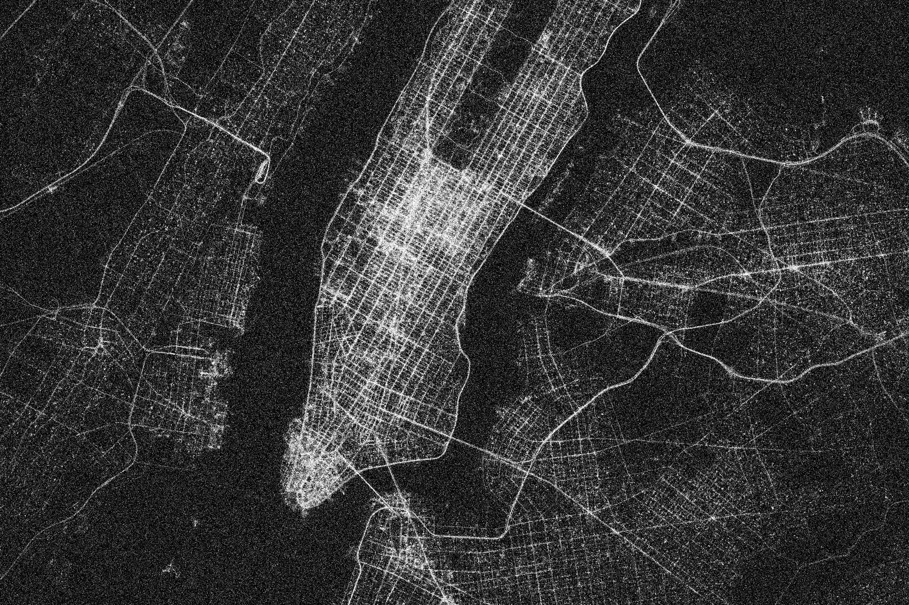
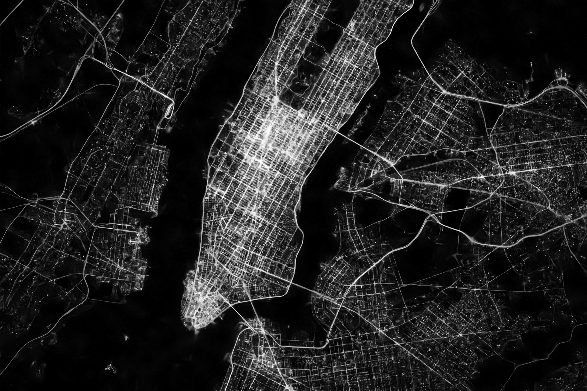

# EDITS
Differentially Private Data Publishing by Image Denoising

### Introduction

This project proposes EDITS, a novel image denoising-based post-processing framework, to transform DP-protected data into images and use image denoisers to improve the published data accuracy while maintaining the privacy guarantee by DP. 

EDITS is flexible and can be applied to a variety of data types, such as time-series data, histogram data and geospatial data. 

We prototyped the framework by adopting the filter- and deep learning-enabled denoisers but the user can also choose any preferred denoising methods thanks to the modular design of EDITS. 

### Installation

Python 3.6.11 is used in our experiments.

The required packages and corresponding versions can be found in the requirements.

You can clone this repository and install them with *pip*.

### Structure and Usage

The structure of EDITS is shown as:

In this repository, we submitted the core functional components. 

This basic version implements most of the functions and is ready to be put into experiments.

The complete automation framework will appear in subsequent submissions.

### Example

Here we give an example to illustrate the effect of EDITS.

This image is a map of New York City taxi trajectory during a certain period of time, including geographic location information. The denser area in the image represents the greater traffic volume.

Adding noise (sigma = 75) to the image can protect certain privacy information, as shown below:

After the post-processing operation of EDITS, the accuracy of data is greatly improved without destroying the original privacy protection degree.

### License

This project is licensed under the terms of the AGPL-3.0 license. See [LICENSE](./LICENSE) for additional details.